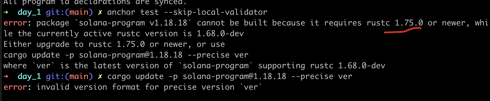
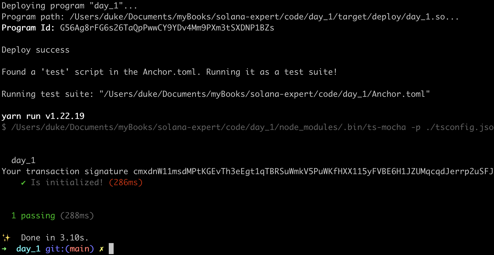

# HELLO WORLD


## Install Requirements

### Rust

```sh
curl --proto '=https' --tlsv1.2 -sSf https://sh.rustup.rs | sh
```

### Solana cli

```sh
# install solana
sh -c "$(curl -sSfL https://release.solana.com/stable/install)"
```

### Anchor

```sh
# install anchor
cargo install --git https://github.com/coral-xyz/anchor avm --locked --force

avm install latest
avm use latest
```

## Create Project

```sh
anchor init day1 # use day_1 if you have a mac
cd day1
anchor build
```

### Config Solana network

to localhost

```sh
# shell 1
solana config set --url localhost

# output: 
Config File: /Users/duke/.config/solana/cli/config.yml
RPC URL: http://localhost:8899
WebSocket URL: ws://localhost:8900/ (computed)
Keypair Path: /Users/duke/.config/solana/id.json
Commitment: confirmed
```

### Run validator node

```sh
# shell 2
solana-test-validator
```

this command would create a local folder to `test-ledger`, it would store all the simulating data, and if you run this command again, be sure to execute at the same level as this folder.

### Sync up

```sh
# shell 1
anchor keys sync

# output
All program id declarations are synced.
```

### Run Anchor Tests

```sh
# shell 1
anchor test --skip-local-validator
```

Error:



Fix Error:  [check here](https://solana.stackexchange.com/questions/9930/error-package-solana-program-v1-18-1-cannot-be-built-because-it-requires-rust/9982#comment8105_9982)

> solana is too new, chat-gpt won't help much sometimes, still need to google.

```sh
solana-install init 1.18.18

# 1.18.18 should equal to the error message: `solana-program v1.18.181`
```

### Create a new wallet

```sh
solana-keygen new -o /Users/duke/.config/solana/id.json

# output:
Wrote new keypair to /Users/duke/.config/solana/id.json
========================================================================
pubkey: HjU6xSZme7ER6Qhk841nczwXijBZ9e1GWLqdPxW6gS9w
========================================================================
Save this seed phrase and your BIP39 passphrase to recover your new keypair:
fix air journey asthma help pulse ankle jeans return fragile renew equal
========================================================================
```

### Sol Airdrop

```sh
# solana airdrop 100 <Your Address>
solana airdrop 100 HjU6xSZme7ER6Qhk841nczwXijBZ9e1GWLqdPxW6gS9w

# output:
Requesting airdrop of 100 SOL

Signature: xTrkhn7tad5tMMS9dn3ZA12EtR5LsoLaUYrUjN8gjQZYMkBTs55LVGQS3dLuKbRmMoXoWLWiToY2ReQJwBcMZgc

100 SOL
```

### Test Succeed




## 关系

- Cargo：rust包管理工具
- Rustc：rust编译器
- Anchor：[solana开发框架](https://www.anchor-lang.com/)


## Links
- original url: https://www.rareskills.io/post/hello-world-solana
- source_code: https://github.com/dukedaily/solana-expert-code/tree/day_1