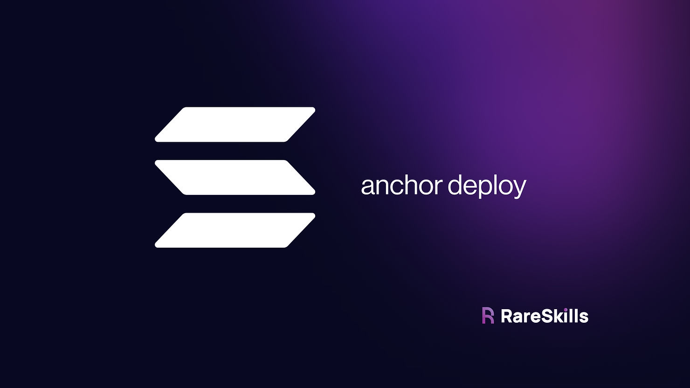
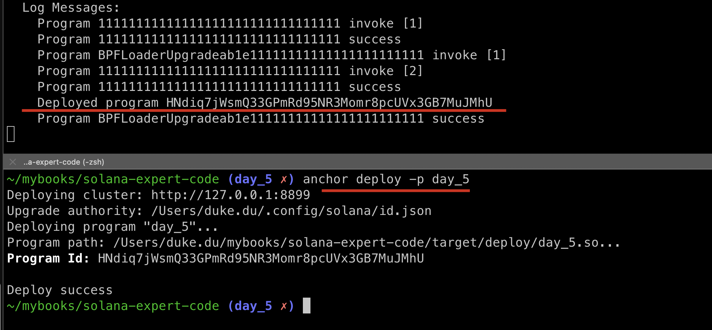
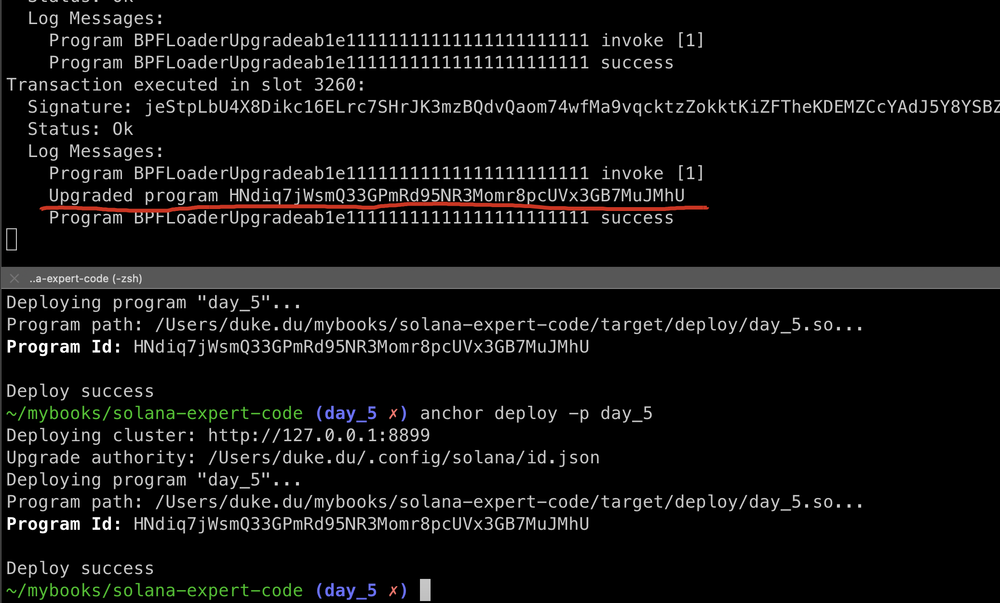
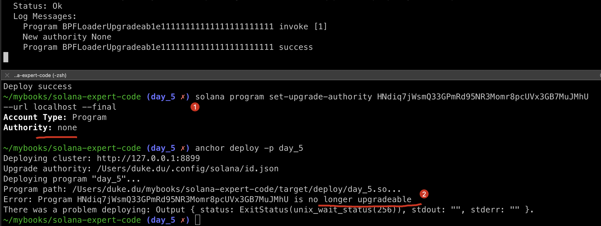

# UPGRADE_INTERACT



We will div into Solana deployment process throughout this session.


## Deploy and Upgrade

create a new program day_5 via command

```sh
anchor new day_5
```

start logs

```sh
solana logs
```

build and deploy this new program solely by the specific flag: `-p`

```sh
# -p, --program-name <PROGRAM_NAME>
anchor build -p day_5
```


deploy `anchor deploy -p day_5`



re-run this deploy command again: `anchor deploy -p day_5`



as you may see:

1. When we deploy for the first time, it's truely deployed, but it's called `upgrade` if we redeploy. 
2. The program id remains the same.

from this we can understand that: 

1. By default,  a solana program is mutable. 
2. We can upgrade the sc (smart contract) in Solana without a Proxy, the upgradability is supported natively.

**But if so, how can we guarantee that a program is not changed abusively by the owner?**


## Forfeit ownership

In solidity, a commonly way to balance the upgrade power and minimal changes to the sc is to deploy a proxy sc,  and give up the super power by  transfer the ownership to ZERO address later on if no bugs are found.


in solana, we can achieve this much easier by the following command.

```sh
solana program set-upgrade-authority <PROGRAM_ID> --url localhost --final
```

this command will set the authority to None, so no one can redeploy anylong, let's try it out!



as you can see, after the first command got executed, the Authority field becomes None, which means no super admin retains anymore. and when i try to deploy day_5 again, it complains that this program is no longer upgradeable, perfect!


## How To Interact With A Program

when we try to make a sc call via ethers.js in ethereum, we need to specific two things: `ABI` and `sc address`.

- SC Address: we can get the `bytecode` of a sc by Address.
- ABI: Application Binary Interface, which can be used to parse the bytecode.

In solana, we do it same way, but with different names:

- Program ID: same to solidity address.
- IDL: Interface Definition Language, same to ABI, we cover this concept in `day_3`.

## Update Testcase

Create `tests/day_5.ts`

```ts
import * as anchor from "@coral-xyz/anchor";
import { Program } from "@coral-xyz/anchor";

import fs from 'fs'
let idl = JSON.parse(fs.readFileSync('target/idl/day_5.json', 'utf-8'))

describe("day_5", () => {
  anchor.setProvider(anchor.AnchorProvider.env());

  // const programID = "HNdiq7jWsmQ33GPmRd95NR3Momr8pcUVx3GB7MuJMhU";
  const program = new Program(idl, anchor.getProvider());
  it.only("Is initialized!", async () => {
    const tx = await program.methods.initialize().rpc();
    console.log("Your transaction signature", tx);
  });
});
```

We will load the new program with idl, the address locates in the day_5.json.

execute the test code without new deployment.(it will fail if we do so, cos we have already deprecated the upgradability before).


```sh
anchor test --skip-local-validator -p day_5 --skip-deploy
```


the `initialize`function called successfully!


## Key Takeways

1. solana support upgradibility natively and can forfeit afterwards.


## Links

- day5 original article: https://www.rareskills.io/post/solana-anchor-deploy
- source code: https://github.com/dukedaily/solana-expert-code/tree/day_5
