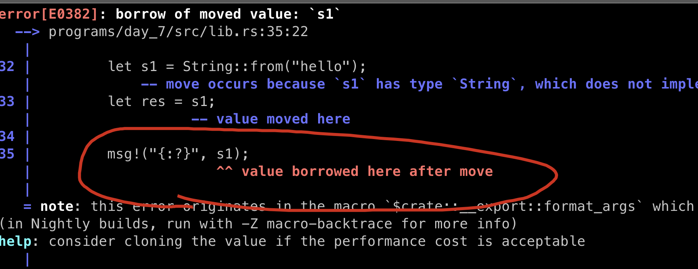

# Rust Interesting Syntax


In this session, we will discuss the following syntax: 

- &
- mut
- <_>
- unwrap()
- ?

## Copy Type vs Non-Copy Type

this is roughly the same concepts to `Value Type` and `Reference Type` as Solidity.

- it a type has the certain small size and easy to copy, including: `integers, unsigned, and floats integers, booleans, char`.
- Non-copy type: `Strings, vectors, structs`, etc

create program day_7

```sh
anchor new day_7
```

And update with the following code (be sure to replace with your program id).

```rust
use anchor_lang::prelude::*;

declare_id!("2V4BSWLCWVP5CmrxbcpKG1bqczwgirs43euQtHDJqwDa");

pub fn add(a: u32, b: u32) -> u32 {
    a + b
}

pub fn concat(s1: String, s2: String) -> String {
    format!("{}{}", s1, s2)
}

#[program]
pub mod day_7 {
    use super::*;

    pub fn copy_types(ctx: Context<Initialize>) -> Result<()> {
        let a: u32 = 2;
        let b: u32 = 3;
        msg!("{} + {} = {}", a, b, add(a, b));

        let s1 = String::from("hello");
        let s2 = String::from(" world");

        // if s1 and s2 are copied, this could be a huge data transfer
        // if the strings are very long
        msg!("{}{}", s1, s2);
        Ok(())
    }
}

#[derive(Accounts)]
pub struct Initialize {}

```

add test file `tests/day_7.ts`: 

```ts
import * as anchor from "@coral-xyz/anchor";
import { Program } from "@coral-xyz/anchor";
import { Day7 } from '../target/types/day_7';

describe("day_7", () => {
  anchor.setProvider(anchor.AnchorProvider.env());
  const program = anchor.workspace.Day7 as Program<Day7>;

  it("should succeed copy types!", async () => {
    const tx = await program.methods.copyTypes().rpc();
    console.log("You tx signature:", tx);
  })
})
```

Result:


within this demo, both a and b are type of u32, means when pass to function `add`, only need to copy 4Bytes * 2 are copied, so they are copy type.

but for the two strings, they don' have a fixed size, which means they can be as long as 1GB or 2GB, and if we use copy type on them, the system will need to allocate (1GB or 2GB) *2 for the concatenation, it's crazy, so string type must be non-copy type.


## Ownership

the ownership concept is only an issue with (apply to) non-copy-types: `Strings, vectors, structs`, and the usage is alike the term of`reference` in C++, let's dive into the details.

add this function into the code base.

```rust
    pub fn ownership(ctx: Context<Initialize>) -> Result<()> {
        let s1 = String::from("hello");
        let res = s1; // res become the owner of value: "hello"

        msg!("{:?}", s1); // this line won't compile, cos s1 is no longer the owner of value: "hello"
        msg!("{:?}", res);

        Ok(())
    }
```

and you will see this error after compilation.



To fix the code above we have two options: use the & operator or clone s1.


## borrowing

**To give another variable or function a view of an owned variable, we prepend it with: ** **&**.

```rust
    pub fn ownership(ctx: Context<Initialize>) -> Result<()> {
        let s1 = String::from("hello");
        let res = &s1;

        msg!("s1 under view: {:?}", s1);
        msg!("res view s1: {:?}", res);

        let s2 = String::from("world");
        let res2 = s2;
        msg!("res2 owns s2: {:?}", res2);

        Ok(())
    }
```

s2 can now view `String::from("hello")` but not own it, it will holds a reference to the string value in s1, **but s1 still holds its original string value**.

in rust, we the techitical word of what we are calling `view only` is : borrowing.


## Borrowing (copy-type)

```rust
    pub fn borrow_integer(ctx: Context<Initialize>) -> Result<()> {
        let a = 10;
        let b = &a;
        let c = a;

        msg!("a: {:?}", a);
        msg!("b: {:?}", b);
        msg!("c: {:?}", c);
        Ok(())
    }

```

a, b, c all hold a new copy of value 10, the underlying reason is that the overhead is negligible.


## clone a object

if a var of a non-copy-type is being borrowed, it cannot be reassigned, check the code below.

```rust
    pub fn clone_test(ctx: Context<Initialize>) -> Result<()> {
        let mut s1 = String::from("hello");
        // let y = &s1; // comment this line

        s1 = s1 + " world";
        // msg!("y : {:?}", y); // comment this line
        msg!("s1: {:?}", s1);
        Ok(())
    }
```

everything works now, then we uncomment two lines above, and the complier will complain:

```rust
    pub fn clone_test(ctx: Context<Initialize>) -> Result<()> {
        let mut s1 = String::from("hello");
        let y = &s1;

        s1 = s1 + " world";
        msg!("y : {:?}", y);
        msg!("s1: {:?}", s1);
        Ok(())
    }
```


in order to make it work, we can not borrow anymore, instead of we `clone`.

```rust

    pub fn clone_test(ctx: Context<Initialize>) -> Result<()> {
        let mut s1 = String::from("hello");
        // let y = &s1;
        let y = s1.clone(); // add this line

        s1 = s1 + " world";
        msg!("y : {:?}", y);
        msg!("s1: {:?}", s1);
        Ok(())
    }
```

Now, y has an entire copy of s1, no constraint anymore.


Interesting thing: if we only comment the `msg!`line and keep the borrowing line, it still work.

```rust
    pub fn clone_test(ctx: Context<Initialize>) -> Result<()> {
        let mut s1 = String::from("hello");
        let y = &s1;

        s1 = s1 + " world";
        // msg!("y : {:?}", y);
        msg!("s1: {:?}", s1);
        Ok(())
    }
```


## Key Takeaways


## Links

- day_7 original article: https://www.rareskills.io/post/rust-weird-syntax
- source code: https://github.com/dukedaily/solana-expert-code/tree/day_7