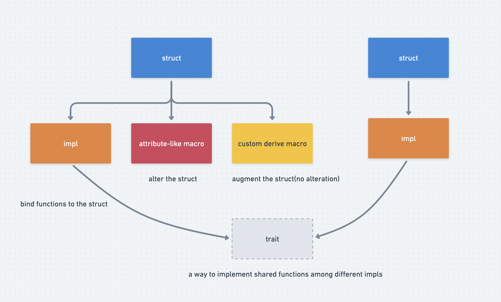

# Attribute-Like AND Custom Derive MACROS


## Three macros

normally we will encounter three types of macros within solana programs as below:

1. **Function-like macro:** a wrapper to a function, it will expand during the compilation, such as: `msg!` and `println!`.
2. **Attribute-like macro:** a wrapper to a struct, and can completely rewrite it.
3. **Custom derive macro:** a wrapper to a struct which will augments it with additional functions but cannot alert it.


we have discussed about: function-like macro before and will cover the rest here today.



## Impl

A impl is similar to a `lib` in solidity, we can bind some functions to a lib and use it with the syntax myLib.newFunction().

in rust, we can use the keyword `impl`to associate functions to a `struct`, we can test it in [playground](https://play.rust-lang.org/?version=stable&mode=debug&edition=2021).

```rust
struct Person {
    name: String,
    age: u8,
}

impl Person {
    fn new(name: String, age: u8) -> Self {
        return Person { name, age };
    }

    fn can_drink(&self) -> bool {
        return self.age >= 21;
    }

    fn get_age(&self) -> u8 {
        return self.age;
    }
}

fn main() {
    let alice = Person::new("Alice".to_string(), 30);
    println!("Can Alice drink? {}", alice.can_drink());
    println!("Alice's age: {}", alice.get_age());
}
```

// Output:

```sh
Can Alice drink? true
Alice's age: 30
```

now we have associated three functions with struct `Person`.

## Traits

Rust Traits are a way to implement shared behavior among different impls. ~~Think of them like an interface or abstract contract in solidity ---- any contract that uses the interface must implement certain functions.~~

Think of them like `polymorphism` in C++, be attention to function `get_speed` below, it accepts different instance of`impl` and gets different result accordingly.

```rust
// Traits are defined with the `trait` keyword followed by their name
trait Speed {
    fn get_speed_kph(&self) -> f64;
}

// Car struct
struct Car {
    speed_mph: f64,
}

// Boat struct
struct Boat {
    speed_knots: f64,
}

// Traits are implemented for a type using the `impl` keyword as shown below
impl Speed for Car {
    fn get_speed_kph(&self) -> f64 {
        // Convert miles per hour to kilometers per hour
        self.speed_mph * 1.60934
    }
}

// We also implement the `Speed` trait for `Boat`
impl Speed for Boat {
    fn get_speed_kph(&self) -> f64 {
        // Convert knots to kilometers per hour
        self.speed_knots * 1.852
    }
}

// Function to get the speed in km/h for any type implementing the Speed trait
fn get_speed(transport: &dyn Speed)-> f64 {
    return transport.get_speed_kph();
}

fn main() {
    // Initialize a `Car` and `Boat` type
    let car = Car { speed_mph: 60.0 };
    let boat = Boat { speed_knots: 30.0 };

    // Get and print the speeds in kilometers per hour
    let car_speed_kph = car.get_speed_kph();
    let boat_speed_kph = boat.get_speed_kph();

    println!("Car Speed: {} km/h", car_speed_kph); // 96.5604 km/h
    println!("Boat Speed: {} km/h", boat_speed_kph); // 55.56 km/h

    // polymorphism
    println!("Polymorphism Car Speed: {} km/h", get_speed(&car));
    println!("Polymorphism Boat Speed: {} km/h", get_speed(&boat));
}
```

output:


## Att-like macro

we can use attribute-like macro to change a struct, the technique beneath the surface is `impl` we just described.

we test in `rust_projects` other than anchor programs.

```sh
mkdir rust_projects
cd rust_projects
cargo new day_8_1
```

### remove fields from a struct


### add  fields into a struct

## Derive macro

This support a way to augment a struct without changing it.


## Key takeaways


## Links

- Day_8 original article: https://www.rareskills.io/post/rust-attribute-derive-macro
- source code: